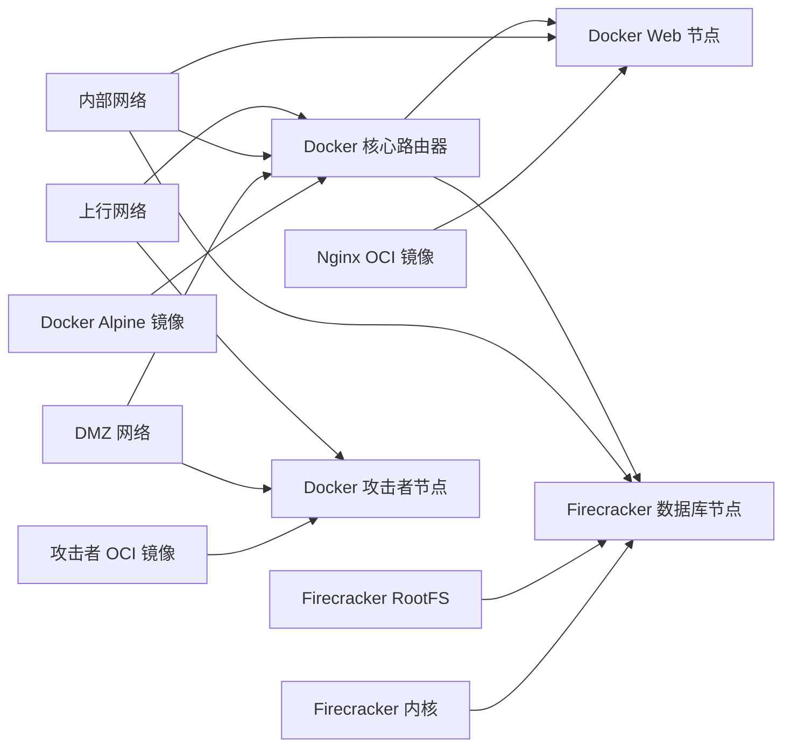
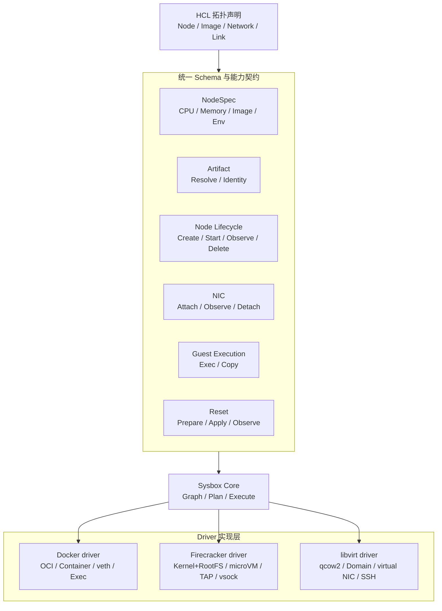

# sysbox 资源模型与能力

> 本文介绍 sysbox 的资源类型模型：有哪些资源类型与顶层块、它们如何组合、执行引擎（substrate/driver/provider）如何组织，以及如何扩展新的资源类型或执行引擎。
>
> 字段级精确定义见 [HCL Reference](./hcl.md)；系统边界与持久契约见 [Architecture](../architecture.md)。本文只讲「模型与分类」，不重复字段表。

---

## 1. 总览

sysbox 接收 HCL 拓扑声明，解析为资源图（typed resource graph），再通过执行引擎把「声明」落地为宿主机上的真实对象。

HCL 里的「类别」分三层，这是理解整个模型的关键：

| 层 | 例子 | 作用 |
|---|---|---|
| **顶层块** | `substrate` / `variable` / `locals` / `module` / `data` / `resource` / `output` | 组织配置、注册引擎实例、声明变量/局部量/模块/只读查询/导出值 |
| **资源类型** | `sysbox_image` / `sysbox_node` / `sysbox_network` / `sysbox_kernel` / `sysbox_router` / `sysbox_firewall` / `sysbox_ssh_access` | 声明拓扑意图（「要有什么」），共 7 类 |
| **引擎私有块** | `provider "docker" {}` / `provider "firecracker" {}` / `provider "libvirt" {}` | 某个节点上、具体执行引擎的私有参数（「怎么跑」） |

`resource` 块是拓扑的主体；`data` 块是只读查询（不创建资源），`substrate` 块注册引擎实例。

---

## 2. 七类资源

| 资源类型 | 是什么 | 必填字段 | 引用关系 |
|---|---|---|---|
| `sysbox_image` | 可拉取的镜像 / 制品（OCI、rootfs、qcow2） | `substrate` `kind` `source` `architecture` `guest_family` | 被 `sysbox_node`/`sysbox_router` 引用 |
| `sysbox_kernel` | 可拉取的内核制品（firecracker 用） | `substrate` `architecture` `source` | 被 firecracker 节点的 `provider` 块引用 |
| `sysbox_network` | 一个网络（CIDR + 可选 NAT） | `cidr` | 被 `sysbox_node` 的 `link`、`sysbox_router` 的 `interface` 引用 |
| `sysbox_node` | 一个计算节点（容器 / 微 VM / VM） | `substrate` `image` | 引用 image/network/kernel；可被 firewall/ssh_access 附着 |
| `sysbox_router` | 多接口路由器（可 NAT） | `substrate` `image` | 引用 image/network |
| `sysbox_firewall` | 挂到某节点的防火墙策略（规则 + 默认策略） | `attach_to` | 引用一个 `sysbox_node` |
| `sysbox_ssh_access` | 对某节点的 SSH 授权入口 | `node` `authorized_keys` | 引用一个 `sysbox_node` |

完整字段（含 optional 字段、类型、默认值）见 [HCL Reference](./hcl.md) 的对应小节。

---

## 3. 组合关系（资源粒度）

资源通过**类型化引用**彼此组合，形成有向依赖图。引用一律使用规范身份（canonical address）：

```hcl
image   = sysbox_image.web.id       # 引用一个 image 资源
network = sysbox_network.dmz.id     # 引用一个 network 资源
kernel  = sysbox_kernel.linux.id    # 引用一个 kernel 资源
attach_to = sysbox_node.web.id      # 引用一个 node 资源
```

组合关系概览：

```text
sysbox_image ──┐
               ├──> sysbox_node ──(link)──> sysbox_network
sysbox_kernel ─┘         │
                         ├──(attach_to)<── sysbox_firewall
                         └──(node)<────── sysbox_ssh_access

sysbox_image ──> sysbox_router ──(interface)──> sysbox_network
```

一个混合拓扑的依赖图示例（箭头表示「后者依赖前者」）：



**粒度的几个要点**：

1. **制品是叶子**：`sysbox_image` / `sysbox_kernel` / `sysbox_network` 不引用其他资源，是最小声明单元。
2. **节点是枢纽**：`sysbox_node` 引用 image（主镜像）、network（经 `link` 块）、kernel（经 `provider` 块的 `kernel`）。一个节点可以有多个 `link` 块（多网卡），每个 `link` = 挂到某个 network 的一条逻辑网卡。
3. **策略/访问是附着物**：`sysbox_firewall` 和 `sysbox_ssh_access` 不创建计算对象，而是「附着」到已有的 `sysbox_node` 上，表达安全策略与访问入口。
4. **节点级的引擎参数**（如 docker 的 `command`、firecracker 的 `kernel`、libvirt 的 `network_init`）不写成独立资源，而是放在节点内的 `provider "X" {}` 块里——它们是「怎么跑」，不是「有什么」。

---

## 4. 执行引擎：substrate / driver / provider

这三个词描述的是同一件事的三个切面，容易混淆，特此区分：

| 术语 | 代码位置 | 是什么 |
|---|---|---|
| **substrate**（抽象） | `pkg/substrate` | 执行引擎的抽象接口与中立类型（`NodeSpec`/`NodeHandle`/`ManagedNetworkSpec` 等）；`BaseSubstrate` 提供默认实现 |
| **driver**（实现 + 注册） | `pkg/provider/{docker,firecracker,libvirt,network}` + `pkg/driver` | 每个引擎的具体实现，通过 `driver.Descriptor` 注册进 `driver.DefaultRegistry` |
| **provider "X" {}**（节点私有配置） | `pkg/config/schema.go` 的 `ProviderBlock` | 节点内嵌的引擎私有参数块，X 必须等于引擎名，解码为各引擎的 `Config`（如 `*docker.Config`） |

当前支持的引擎：

| 引擎 | 作用 | 典型节点形态 |
|---|---|---|
| `docker` | 容器 | OCI 镜像 + 共享内核 |
| `firecracker` | 微 VM | rootfs + 独立内核（`sysbox_kernel`） |
| `libvirt` | 完整 VM | qcow2 + cloud-init |
| `network` | 受管网络 | 为 network 资源提供 bridge / 隔离 |

对应关系：

```hcl
substrate "docker" { alias = "local" }      # 注册引擎实例（driver）
resource "sysbox_node" "web" {
  substrate = substrate.docker.local        # 选引擎（substrate 引用）
  provider "docker" {                       # 引擎私有参数（provider 块）
    privileged = true
  }
}
```

分层视图——统一 schema 规定 driver 必须接收什么输入、提供什么操作、返回什么状态，各 driver 负责具体实现：



---

## 5. 能力与扩展模型

sysbox 的扩展有两个正交的维度：**新增资源类型**、**新增执行引擎**。两者都靠「注册表 + 能力接口」实现，而不是在核心代码里写死。

### 5.1 资源类型扩展（resource handler registry）

每个资源类型对应一个 handler，`init()` 里注册：

```go
// pkg/runtime/resource_node.go 等
func init() { RegisterResourceHandler(NodeResourceHandler{}) }
```

handler 拥有该类型的 schema、解码、验证、依赖提取、planning、observation、import 归一化与生命周期规则。**新增一个资源类型 = 定义它的 schema + 实现一个 handler + 注册**，graph/planner 不感知具体类型。

### 5.2 执行引擎扩展（driver descriptor + capability registry）

每个引擎注册一个 `driver.Descriptor`，声明自己实现了哪些 capability（共 17 种）：

```go
// pkg/driver/capability.go
type Descriptor struct {
    Name, Version string
    Node Node; NIC NIC; Artifact Artifact; Network Network
    LinuxNetwork LinuxNetwork; GuestNetworkInit GuestNetworkInit
    // ... 共 17 个 capability 字段
}

// pkg/driver/registry.go
driver.DefaultRegistry.Register(descriptor)
driver.DefaultRegistry.Require(name, capability)   // 支持才给，不支持报 ErrorUnsupported
```

17 种 capability：`node`、`nic`、`snapshot`、`console`、`guest-exec`、`guest-files`、`network`、`artifact`、`import`、`node-state`、`image-entry`、`power`、`linux-network`、`guest-network`、`guest-network-init`、`reset`、`policy`。

**新增一个执行引擎 = 实现它需要的 capability 接口 + 注册一个 Descriptor**。planner 在 mutation 前会校验所需 capability 是否存在。

### 5.3 两个维度的边界

- **handler 定义「资源意味着什么」**，driver 定义「如何操作外部系统」。
- runtime 不导入 docker / firecracker / libvirt / nftables 的具体实现，只通过 registry 按 capability 请求。
- `pkg/substrate` 只承载中立的数据类型，不负责 registry 或引擎选择。

---

## 6. 术语速查

| 术语 | 含义 |
|---|---|
| resource type | 资源类型（7 类），拓扑意图的声明单元 |
| resource block | `resource "TYPE" "NAME" {}`，HCL 里的资源声明 |
| top-level block | `substrate`/`variable`/`locals`/`module`/`data`/`resource`/`output` |
| data block | 只读查询，不创建资源 |
| canonical address | `sysbox_node.web` 这类规范身份，贯穿 graph/plan/state/CLI/API |
| substrate | 执行引擎的抽象层 |
| driver | 执行引擎的具体实现及其 Descriptor |
| provider block | 节点内嵌的引擎私有参数块 |
| capability | 引擎声明自己「能做某事」的能力单元 |
| handler | 资源类型的所有者（schema/解码/规划/生命周期） |
