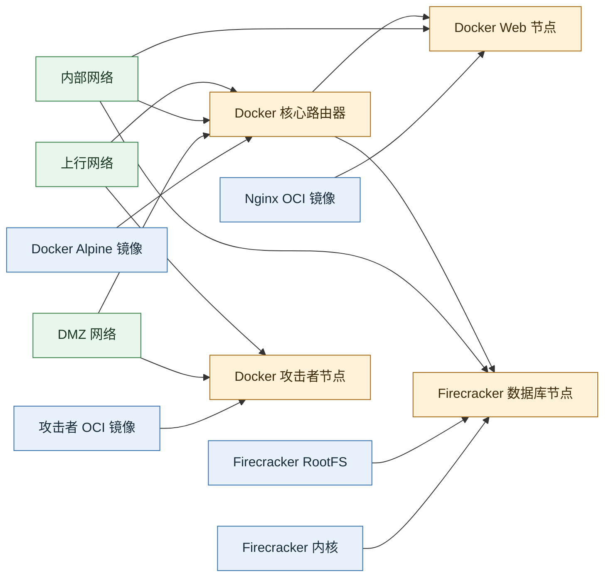
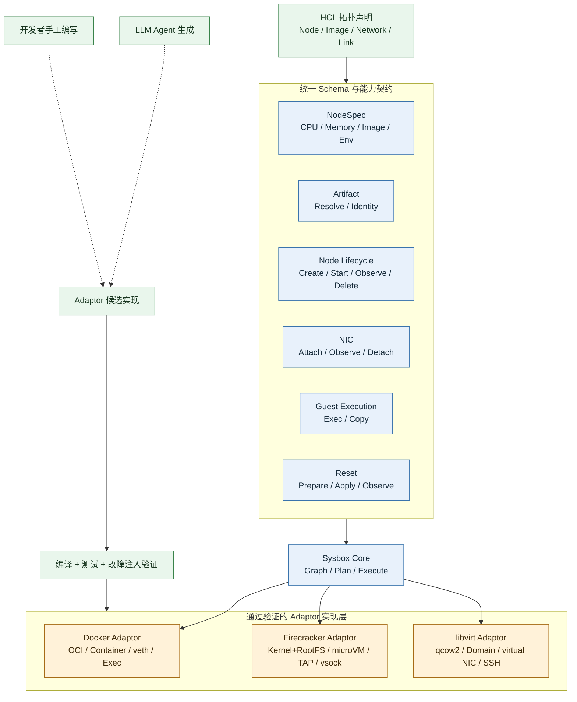
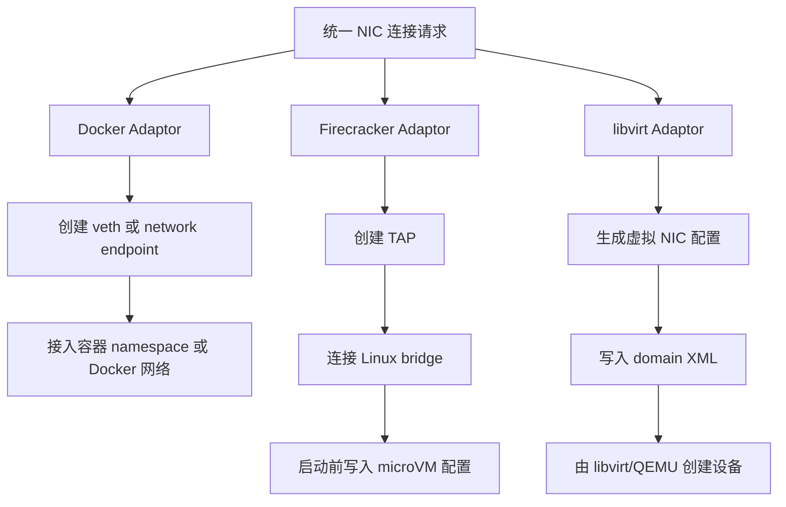
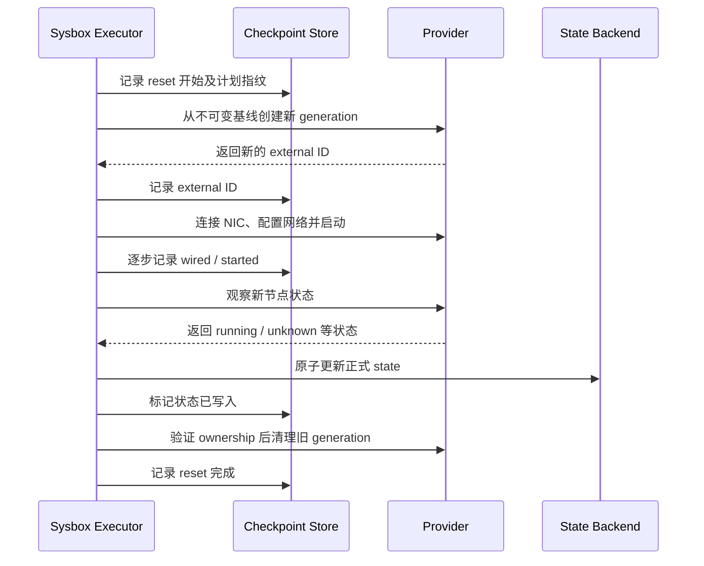

# Sysbox 三个核心挑战及其解决方案

本文档介绍 Sysbox 解决的三个核心挑战：资源的依赖约束、系统对象的异构特征，以及异常状态下的一致性与恢复。

## 1. 资源的依赖约束

### 1.1 依赖图依据什么构建？

Sysbox 从用户编写的 HCL 拓扑配置中提取资源及其依赖关系，并将它们组织成一个有向无环图（DAG）。依赖主要来自两部分：

1. **资源引用形成的隐式依赖**：例如节点的 `image` 字段引用镜像，节点的 `link` 引用网络，Firecracker 配置引用内核。
2. **`depends_on` 声明的显式依赖**：用于表达不能仅从字段引用中推导出的执行约束，例如 Web 节点需要等待路由器就绪。

例如：

```hcl
resource "sysbox_node" "web" {
  image = sysbox_image.nginx.id

  link "internal" {
    network = sysbox_network.internal.id
    ip      = "10.0.2.10/24"
  }

  depends_on = [
    "sysbox_router.core",
  ]
}
```

这段配置至少产生三条依赖：

- Web 节点依赖 Nginx 镜像；
- Web 节点的网卡连接依赖内部网络；
- Web 节点显式依赖核心路由器。

Sysbox 会检查依赖对象是否存在，并拒绝包含循环依赖的拓扑。

### 1.2 偏序关系是什么？

偏序关系只规定“哪些资源必须先完成”，不要求所有资源具有唯一的执行顺序。

例如，若用 `A < B` 表示“创建 B 前必须先创建 A”，则：

```text
镜像 < 节点
网络 < 网卡连接
路由器 < Web 节点
```

两个互不依赖的镜像之间没有先后关系，可以独立或并行准备。创建资源时，Sysbox 按依赖关系的拓扑顺序执行；销毁资源时，则按相反顺序执行。

### 1.3 混合实验拓扑示例

下面的例子包含 Docker 容器、Firecracker 微虚机、三个网络和一个路由器。箭头 `A --> B` 表示“B 依赖 A”。



依赖图解决了三个问题：

- 创建资源时应该先做什么；
- 删除资源时应该先删什么；
- 某个资源变化时，哪些下游资源可能受到影响。

需要注意，Sysbox 不会因为依赖发生变化就无条件重建所有下游资源。是否需要替换，由对应资源类型的 handler 根据该变化的实际语义判断。

## 2. 系统对象的异构特征

### 2.1 Adaptor 如何产生？

Docker 容器、Firecracker 微虚机和 libvirt 虚拟机的镜像、启动、网络和重置机制不同。Sysbox 为它们定义统一的能力接口，再由各自的 Provider/Substrate Driver 将通用请求转换成底层操作。

Adaptor 的输入边界由统一 schema 和能力契约确定。在当前 Sysbox 实现中，Docker、Firecracker 和 libvirt adaptor 主要由开发者手工编写；在工程方法上，也可以由 LLM Agent 根据同一契约生成候选实现，再通过编译、单元测试、集成测试和故障注入验证后接入。Agent 生成改变的是 adaptor 的开发方式，不改变运行时接口。

Core 负责定义“需要完成什么”，例如创建节点、连接网卡或观察状态；adaptor 负责决定“在该系统上具体如何完成”。

### 2.2 统一 Schema 与异构 Adaptor

下面这张图适合用于 PPT。上半部分是 Sysbox 规定的统一资源 schema 和能力契约，下半部分是不同系统对象的 adaptor。HCL 拓扑只描述期望状态；Core 根据统一契约调用 adaptor，不直接包含 Docker、Firecracker 或 libvirt 的专属分支。



这张图要表达的核心是：

> Schema 规定 adaptor 必须接收什么输入、提供什么操作、返回什么状态；人或 Agent 负责生成具体实现，但实现必须通过相同的契约验证。

### 2.3 Adaptor 规则对照

| 通用能力 | Docker Adaptor | Firecracker Adaptor | libvirt Adaptor |
|---|---|---|---|
| 节点类型 | Linux 容器 | KVM 微虚机 | QEMU/KVM 完整虚拟机 |
| 基础镜像 | OCI image | kernel + rootfs | qcow2 |
| 创建节点 | 调用 Docker 创建容器 | 生成配置并启动 Firecracker 进程 | 创建 libvirt domain |
| 网络设备 | veth 或 Docker endpoint | TAP | domain 虚拟 NIC/TAP |
| 网卡接入时机 | 支持运行时接入 | 通常在启动前接入 | 通常写入 domain 配置后启动 |
| Guest 命令执行 | Docker Exec | vsock RPC 或 SSH | SSH |
| 状态观察 | Docker Inspect | 进程、socket 和 guest observation | virsh/domain 查询 |
| Pause/Resume | Docker pause/unpause | 暂停/恢复 Firecracker 进程 | virsh suspend/resume |
| Reset | 重新创建容器 | 从只读基线创建新 VM generation | 从 qcow2 基线创建新 overlay/domain |
| 外部身份 | Container ID | VM generation、进程和 socket | Domain UUID |

这里的“统一”并不是把三种对象强行变成相同对象。Sysbox 统一公共操作和结果，但 kernel、rootfs、domain XML 等专属信息仍由对应 adaptor 管理。

### 2.4 NIC Adaptor 示例

上层可以发出统一的逻辑请求：

```text
AttachNIC(node, network, IP, MAC)
```

不同 adaptor 对它的实现如下：



因此，上层拓扑不需要分别编写 Docker、Firecracker 和 libvirt 的操作流程，只需声明期望的网络连接。

## 3. 异常状态下的一致性与恢复

### 3.1 系统状态如何保留？

Sysbox 不是按照固定时间片定期保存状态，而是在资源创建、替换、删除和重置等关键事件发生时持久化状态。这是一种**事件驱动**的保存方式。

正式 state 保存当前拓扑的完整资源快照。更新时通过 state serial 和 Compare-And-Swap（CAS）防止两个执行者相互覆盖。根据部署方式，state 可以存放在本地文件、SQLite 或 Postgres 中。

每个资源主要保存以下几类状态：

| 状态类别 | 典型内容 | 主要用途 |
|---|---|---|
| 逻辑身份 | canonical resource address、资源类型、driver | 确定实验中的资源是谁 |
| 期望与公共属性 | 镜像身份、IP、MAC、连接信息 | 比较声明配置和当前状态 |
| 外部身份 | Container ID、VM UUID、generation ID | 定位实际系统对象 |
| 依赖与附件 | 依赖地址、NIC attachment | 恢复执行顺序和网络关系 |
| Provider 私有状态 | TAP、socket、overlay、namespace 等 | 供对应 adaptor 恢复或删除资源 |
| Observation 状态 | present、absent、drifted、degraded、unknown | 判断资源是否存在或发生漂移 |
| 时间与版本 | schema version、创建和更新时间 | 验证兼容性并支持审计 |

正式 state 是**全局的当前快照**，不是周期采样结果，也不是一串纯增量日志。不过，每次只会在操作导致状态变化时更新它。

### 3.2 检查点如何生成？

检查点由 Sysbox 执行器在预先定义的关键步骤自动生成。关键步骤和记录内容由开发者在执行器及 provider 代码中设计，不由人工在每次运行时临时填写，也不由 LLM Agent 决定。

检查点属于一次 operation，例如一次 `apply`、`reset` 或 `destroy`，主要记录：

- 本次执行计划及其指纹；
- 操作开始、完成或失败状态；
- 当前处理的资源和动作；
- 已创建外部对象的 provider 与 external ID；
- 网络连接和 reset 等子步骤；
- 尚未写入正式 state 的状态变化；
- 操作前后的 state serial。

例如，一次 reset 可以形成如下检查点序列：



如果中途发生故障，恢复程序读取检查点并重新观察外部系统，然后决定：

- 采用已经成功创建的对象；
- 继续尚未完成的步骤；
- 清理只完成一部分的残留；
- 在无法可靠判断时停止变更，避免重复创建或误删。

### 3.3 是否存在“Agent 生成检查点的正确率”？

不存在这一指标，因为检查点不是由生成式 Agent 生成的。它们由确定性的程序逻辑写入。

更合适的评价指标是：

- 关键破坏性步骤的检查点覆盖率；
- 在不同步骤中断后的恢复成功率；
- 重复恢复是否保持幂等；
- 恢复后是否存在资源泄漏；
- 是否会误删不属于当前实验的对象；
- 最终实际拓扑是否重新收敛到声明状态。

## 4. PPT 总结

三个核心挑战及解决方法可以概括为：

| 核心挑战 | Sysbox 的解决方法 |
|---|---|
| 资源的依赖约束 | 从资源引用和 `depends_on` 构建依赖图，按拓扑顺序创建、逆序销毁，并控制变更影响范围 |
| 系统对象的异构特征 | 定义统一 schema 和能力契约，由开发者编写或 Agent 生成不同 adaptor，并经过统一验证 |
| 异常状态下的一致性与恢复 | 使用事件驱动的完整 state 快照和逐步骤 checkpoint，在恢复时结合外部 observation 安全收敛 |

一句话总结：

> Sysbox 用依赖图解决执行顺序，用 adaptor 解决异构差异，用 state、checkpoint 和 observation 解决异常恢复。
