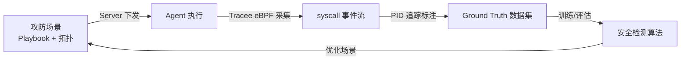
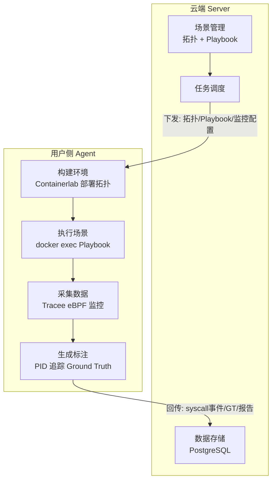
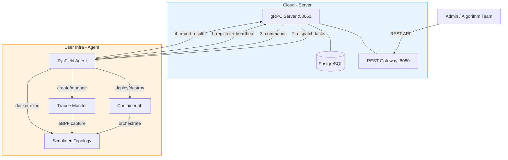
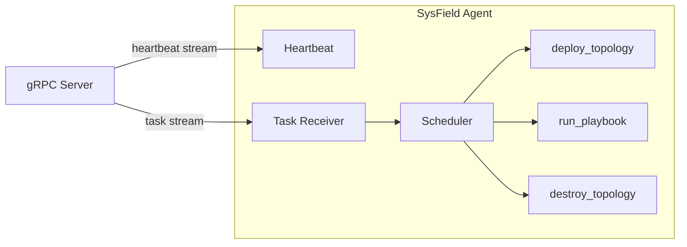
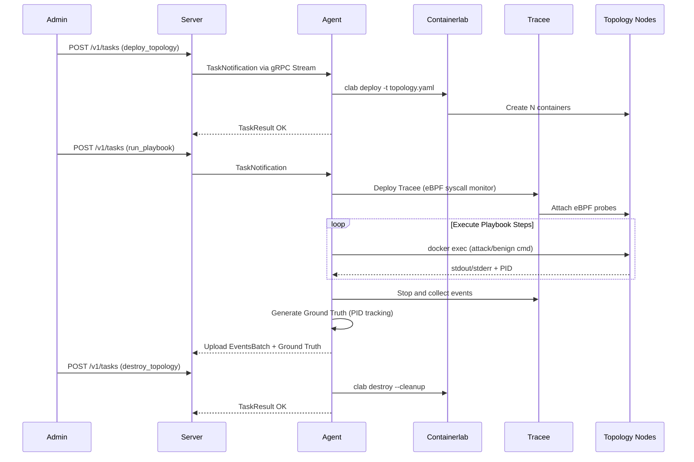
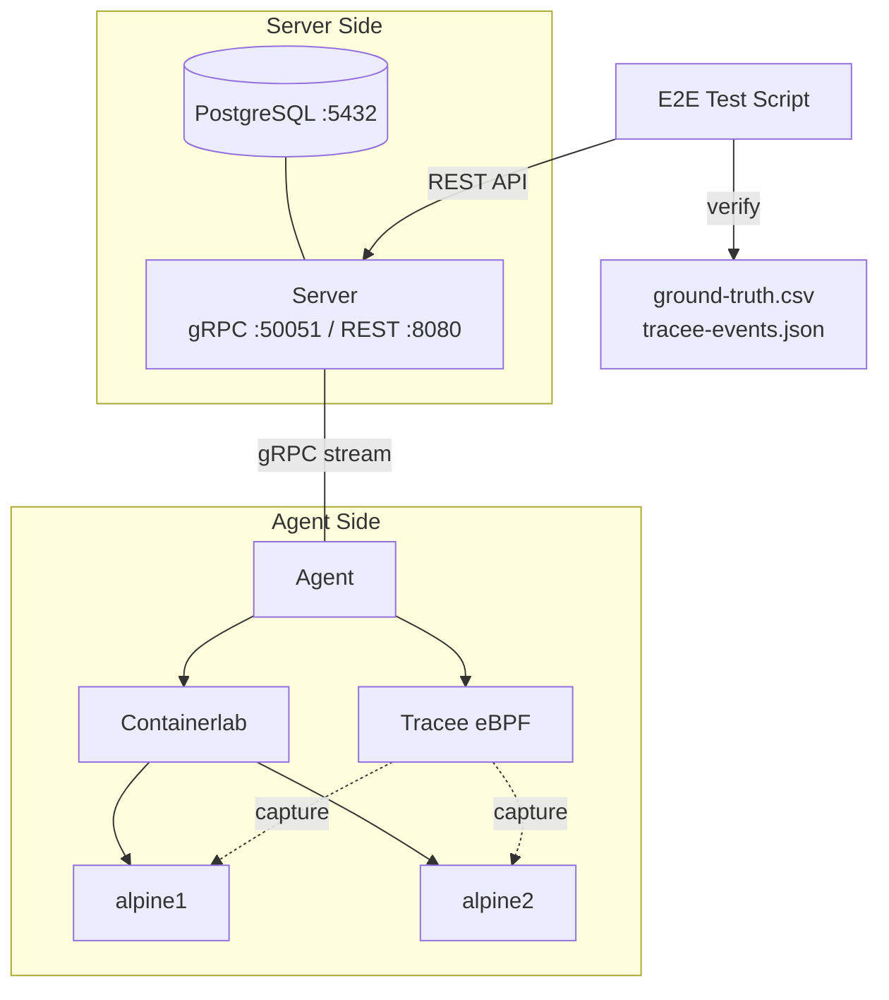

# SysField 项目整体介绍

> 组会汇报 · 2026 年 3 月
> 北京大学计算机学院 · 操作系统实验室

---

## 一、项目定位与目标

**SysField —— 面向安全算法的在线演练与数据采集平台**

核心目标：为安全检测算法提供**自动化的攻防场景执行环境**，在真实基础设施中部署拓扑、执行攻防剧本、采集系统调用数据，并自动生成带标注的 Ground Truth 数据集，打通 **"算法仿真 → 场景执行 → 数据采集 → 算法训练"** 的全链路。

> **一句话**：构建真实靶场场景，执行攻防技战术，采集细粒度日志，生成标注数据集。

借鉴 Datadog 的 Agent 部署模式：云端 Server 负责管控调度，轻量级 Agent 部署到用户侧基础设施执行采集。与 Datadog 的被动监控不同，SysField Agent **主动执行攻防场景 + 监控采集**。

---

## 二、项目输入与输出

**输入**：

| 输入 | 说明 |
|------|------|
| **攻防剧本** (Playbook YAML) | 逐步骤定义攻击/正常行为，映射 MITRE ATT&CK 技术点 |
| **网络拓扑** (Containerlab YAML) | 描述模拟环境的节点、网络连接关系 |
| **监控配置** | 采集哪些 syscall 事件（minimal/standard/full 预设） |

**输出**：

| 输出 | 说明 |
|------|------|
| **在线服务 SysField** | 云端 Server + 边缘 Agent，可持续运行的平台 |
| **syscall 事件流** | Tracee eBPF 采集的 JSON 事件（execve, openat, connect...） |
| **Ground Truth 数据集** | 每条事件标注 attack/benign，含 PID、syscall、时间戳（JSON + CSV） |

**系统数据流**：Server 下发场景 → Agent 构建环境并执行 → 采集 syscall → 生成标注 → 回传数据

---

## 三、整体架构

### 3.1 系统全景

### 3.2 Agent 内部架构

Agent 启动后维持两条 gRPC 长连接：**Heartbeat** 上报状态并接收命令，**Task Receiver** 接收任务交给调度器执行。

### 3.3 场景执行全流程

---

## 四、目前进展

MVP 已实现，通过全自动 Docker Compose E2E 测试（`make test-e2e-compose`）验证完整链路。

### 已完成

- Server 控制面：gRPC 双向流 + REST Gateway + PostgreSQL 持久化
- Agent 守护进程：注册、心跳、任务调度（优先级队列 + 并发控制）
- 三种任务执行器：deploy_topology / run_playbook / destroy_topology
- Playbook 执行引擎：支持 direct/script/http/atomic/network 五种执行器类型
- Tracee eBPF 监控部署与 syscall 事件采集
- Ground Truth 自动生成（PID 追踪 → 子进程传播 → attack/benign 标注）
- 数据上传管线（批量聚合 + gzip/zstd 压缩）
- 完善的测试体系（单元测试 18 packages、Server↔Agent E2E、Docker Compose E2E）

### E2E 验证结果

测试通过 Docker Compose 启动 PostgreSQL + Server + Agent 完整环境，E2E 脚本通过 REST API 驱动全流程：

全部 10 步通过：环境检查 → 服务启动 → Agent 注册 → 部署拓扑（2 个 Alpine 容器）→ 执行 Playbook → Tracee 采集 52 条 syscall 事件 → 验证 Ground Truth 输出 → 销毁拓扑 → 清理服务。

---

## 五、下一阶段规划

### 5.1 短期（本学期）

| 目标 | 具体内容 |
|------|---------|
| **上线部署** | 云端部署 Server，Agent 部署到目标环境持续运行 |
| **数据积累** | 丰富 Playbook 库，覆盖更多 MITRE ATT&CK 技术点，积累 syscall 数据 |
| **与 SysArmor 对接** | 为 SysArmor 校内部署提供攻击场景数据，生成红蓝对抗的 Ground Truth |

### 5.2 中长期

| 目标 | 具体内容 |
|------|---------|
| **多 Agent 协同** | 支持多节点并行采集，扩大数据规模 |
| **数据集标准化** | 标准化输出格式，提供数据查询 API，对接算法训练管线 |
| **论文输出** | 平台架构论文 + 基于平台生成的高质量标注数据集 Benchmark |

---

## 六、个人思考与讨论

1. **Playbook 生态**：当前 Playbook 需手动编写，后续可对接 Atomic Red Team 等开源攻击库，自动转换为平台格式，快速扩充覆盖面。
2. **数据质量**：Ground Truth 的标注准确性直接影响下游算法，建议引入采样人工校验机制。
3. **与 SysArmor 协同**：SysField 生成的标注数据可直接用于 SysArmor 检测算法的训练和评估，两个项目形成闭环。

---

*以上为 SysField 项目整体介绍，欢迎讨论。*
